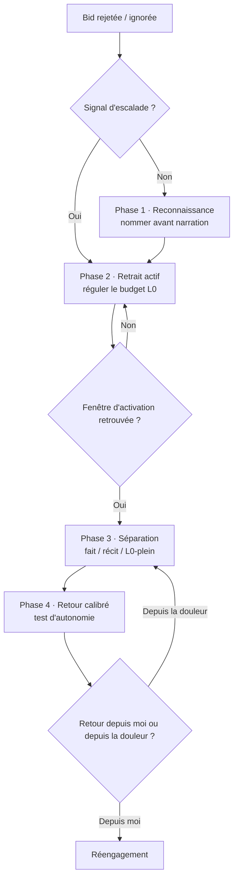

# 🤝 Drill · L1 Appartenance — Bid for connection rejetée

> **Ce protocole adresse :**
> — **Niveau** : [[L1 - Structures profondes/03 — Besoin d'Appartenance]] §I.3 · [[L3 - Émotions/Délaissement]]
> — **Déclencheur** : une offre d'aide ou une tentative de connexion est refusée, ignorée, ou reçoit le silence dans une relation qui compte
> — **Contextes** : relationnel IRL — couple · famille · amis proches

> **Pourquoi ce protocole existe :**
> Une bid for connection rejetée active simultanément quatre L1 (Appartenance · Compétence · Autonomie · Contrôle) et génère une erreur de prédiction proportionnelle à la confiance de la prédiction relationnelle. La douleur s'amplifie dans le temps plutôt qu'immédiatement — ce qui laisse une fenêtre d'intervention avant l'escalade. L'objectif n'est pas de ne pas ressentir la douleur mais de respecter le temps de l'autre tout en canalisant l'intensité.
> → Fondement : [[L1 - Structures profondes/03 — Besoin d'Appartenance]] §I.3 · [[Fondements théoriques/06 — Contrôle perçu & régulation émotionnelle]] §III

> [!info] Échelle de temps variable
> Ce protocole s'applique quelle que soit la durée du cycle. Une bid rejetée par Sassa dans l'instant peut traverser les 4 phases en une heure. Une bid rejetée de façon répétée dans une relation distante (famille, amis éloignés) peut nécessiter des jours ou des semaines entre les phases. **Ce qui fait avancer d'une phase à l'autre, c'est toujours un critère somatique ou cognitif — jamais le temps écoulé.**

---

## 🧭 Modèle du protocole

Les quatre besoins L1 activés en même temps (Appartenance · Compétence · Autonomie · Contrôle) ne se régulent ni au même moment ni par la même action. Chaque phase cible une chose précise :

| Phase | Fonction | Besoin L1 réellement traité |
|---|---|---|
| **1 · Reconnaissance** | Interrompre le signal brut avant qu'il devienne récit | Aucun — signal encore non différencié |
| **2 · Retrait actif** | Restaurer le budget L0 (la ressource, pas le contenu) | **Contrôle secondaire** — le retrait est l'exercice du seul levier disponible : ta propre réponse |
| **3 · Séparation** | Vérifier la lecture de l'événement | Appartenance + Compétence + **Contrôle** (reconnaître que le contrôle primaire est absent — pas un échec, une réalité) |
| **4 · Retour calibré** | Vérifier la direction du réengagement | Autonomie + **Contrôle secondaire** — décider de réengager depuis soi est un acte de contrôle sur sa propre posture, pas sur l'autre |

---

> [!danger] Signal d'escalade — priorité absolue
> Si le corps cherche une sortie physique (poing dans le mur · pleurs intenses sans direction · impulsion de s'imposer à l'autre) : le signal d'escalade indique que la douleur a dépassé la fenêtre cognitive. **Ne pas tenter la Phase 3 dans cet état.** Aller directement en Phase 2. La Phase 3 n'est accessible qu'après retour dans la fenêtre d'activation.
> → [[L0 - Physiologie & Budget Corporel/04 — Fenêtre d'activation]]

---

## Phase 1 — Reconnaissance

> [!abstract] Ce qu'est cette phase
> Le signal affectif brut — une erreur de prédiction relationnelle — précède toute interprétation. Le nommer avec un concept précis, plutôt que de le laisser comme affect diffus, recrute la régulation préfrontale et réduit l'activation amygdalienne (Barrett, 2017). La fonction n'est pas de comprendre l'événement : c'est d'empêcher que le signal brut ne devienne immédiatement une conclusion narrée par les schémas (L2).

**Signal d'entrée :** le moment où tu réalises que la bid a été refusée ou ignorée — avant que la narration commence.

**Ancre somatique :** desserrer la mâchoire · poser la langue à plat · une respiration longue.

**Nommer précisément**, trois éléments dans cet ordre :
1. **Le fait** — ce qui vient de se passer, sans qualificatif *("ma bid vient d'être rejetée / ignorée")*
2. **La validation du ressenti** — la douleur est réelle, elle n'est pas minimisée
3. **La suspension** — ceci n'est pas encore une conclusion sur la relation

**Ce qu'on n'évalue pas encore ici :**
- Ce que le refus "dit" sur la relation
- Si c'était la bonne chose d'offrir
- Ce qu'il faut faire maintenant

**Critère de sortie :** les trois éléments sont nommés intérieurement, l'ancre somatique est posée.

---

## Phase 2 — Retrait actif

> [!abstract] Ce qu'est cette phase
> Tant que le corps reste activé — mâchoire, thorax, rythme cardiaque —, aucune réévaluation cognitive fiable n'est possible (Gross, 1998) : les ressources nécessaires à la Phase 3 ne sont pas encore là. Le retrait actif est une action de régulation physiologique, pas un évitement relationnel : sortir de l'exposition au déclencheur laisse le système nerveux redescendre vers la fenêtre d'activation.
>
> **Lien Contrôle :** le Contrôle primaire (faire répondre l'autre) est absent et le restera. Le retrait actif est la première expression du Contrôle secondaire — exercer un levier sur sa propre réponse plutôt que sur l'autre. C'est la même logique que le [[Protocoles/Transversaux/01 — Drill · L1 Besoin de contrôle — Contrôle secondaire|Drill 01]], appliquée au contexte relationnel.
> → [[L0 - Physiologie & Budget Corporel/04 — Fenêtre d'activation]]

**Retrait passif vs retrait actif :**
- **Passif** : rester exposé au déclencheur en escaladant intérieurement — le budget continue de se dégrader
- **Actif** : sortir de l'exposition avec un cadre clair — une action qui régule le budget

**Formes selon le contexte :**
- *Situation immédiate (IRL)* : quitter physiquement l'espace · mouvement physique · balade
- *Situation digitale / distante* : fermer l'application · ne pas répondre · s'éloigner de l'écran · O&R ou journal pour externaliser
- *Situation chronique (bids répétées sur longues périodes)* : accepter qu'une journée entière — ou plusieurs — soit le retrait. Ne pas forcer la Phase 3 tant que le signal somatique reste élevé.

**Si l'autre est présent :** formuler le retrait en deux éléments — le besoin d'un moment + l'engagement de retour. Pas d'explication, pas de justification.

**Critère de sortie :** la tension physique (mâchoire · thorax · rythme cardiaque) est revenue à un niveau neutre. Critère somatique, pas chronométrique.

---

## Phase 3 — Séparation émotion / relation

> [!abstract] Ce qu'est cette phase
> L'émotion ressentie est fiable : la bid a réellement été rejetée, la douleur est réelle. La *narration* construite depuis cet état ne l'est pas — elle sélectionne les données qui confirment et construit un récit depuis le pôle mal-être (Barrett, 2017 · Gross, 1998). Chacune des questions ci-dessous isole une variable différente du même événement.

**Signal d'entrée :** sortie de Phase 2 — tension physique neutre, fenêtre d'activation retrouvée.

**Quatre questions dans l'ordre :**

1. **Ce qui est réel** — isole les données observables, avant toute interprétation
   → *"Qu'est-ce qui s'est passé concrètement ? Juste les faits."*

2. **Ce qui est construit** — identifie la lecture ajoutée et le schéma qui la produit
   → *"Qu'est-ce que j'entends au-delà des faits, et d'où vient cette lecture ?"*

3. **Ce qui est hors de mon contrôle** — identifie le périmètre réel du levier disponible · [[L1 - Structures profondes/05 — Besoin de contrôle]]
   → *"La réponse de l'autre est-elle dans mon domaine d'action ?"*
   Le contrôle primaire (obtenir une réponse) est absent et le restera. Nommer cela explicitement libère la pression de "trouver quoi faire" — il n'y a rien à faire sur l'autre, seulement sur soi.

4. **Ce que je dirais si le budget L0 était plein** — retire la variable "ressources disponibles"
   → *"Cette lecture tient-elle encore si je n'étais pas déjà en déficit ?"*

**Ce que la Phase 3 ne fait pas :** elle ne minimise pas la douleur, elle ne dit pas que le refus était sans importance. Elle sépare ce qui appartient à l'événement de ce qui appartient à l'état.

> [!info] Phase 3 sur durée longue
> Dans les situations chroniques (bids répétées sur des semaines · relations distantes), la Phase 3 peut se faire en plusieurs passages. Utiliser l'O&R ou le journal entre les passages — écrire les réponses aux quatre questions plutôt que de les tenir mentalement. Le Drill 04 dans le log peut servir à documenter chaque passage.

> [!tip] Cas particulier — quand le besoin d'aider précède la demande
> Si la bid émerge d'un inconfort à voir l'autre dans un état difficile, ajouter une quatrième variable :
> → *"Ce besoin de l'aider vient-il de l'autre, ou de mon propre inconfort face à leur état ?"*
> Distinction entre aide orientée vers l'autre et aide orientée vers le contrôle de son propre inconfort — cœur du [[L1 - Structures profondes/05 — Besoin de contrôle]] (contrôle secondaire vs primaire).

**Critère de sortie :** chaque question a reçu une réponse formulée — pas nécessairement confortable, mais posée.

---

## Phase 4 — Retour calibré

> [!abstract] Ce qu'est cette phase
> Le retrait régule le corps, la séparation clarifie la lecture — mais ni l'un ni l'autre ne garantit que le réengagement soit choisi plutôt que subi. La Phase 4 teste deux besoins L1 simultanément : le **Besoin d'Autonomie** (est-ce que je retourne vers l'autre depuis moi ou depuis la douleur ?) et le **Contrôle secondaire** (est-ce que j'exerce un levier sur ma propre posture plutôt que de subir la situation ?). Décider de réengager — ou de ne pas réengager — depuis un état régulé EST un acte de contrôle secondaire.

**Signal d'entrée :** sortie de Phase 3 — les questions ont une réponse formulée.

**Question test :** *"Est-ce que je retourne vers l'autre depuis moi, ou depuis la douleur non traitée ?"*

- **Depuis moi** → réengager normalement, sans mentionner l'épisode sauf si c'est pertinent pour la relation
- **Depuis la douleur** → attendre, retourner en Phase 3. Le retour prématuré produit exactement le pattern à éviter

> [!info] Phase 4 dans les situations chroniques
> Dans les relations distantes ou les bids répétées, "retourner vers l'autre" peut prendre la forme d'une décision structurelle — envoyer un message, sortir d'un groupe, définir une nouvelle posture relationnelle. La question test reste identique : est-ce que cette décision vient de moi, ou de la douleur non traitée ?

**Sur la relation elle-même :** si le pattern de bids non-reçues s'accumule, c'est un sujet à adresser *à froid* — pas depuis un épisode actif. Moment approprié : quand les deux parties sont disponibles, budget L0 satisfait de part et d'autre.

**Critère de sortie :** réponse stable "depuis moi" à la question test.

---

## Suivi expérientiel

- [ ] Premières utilisations : date · contexte · phase atteinte · résultat observé
- [ ] Identifier si le signal d'escalade est arrivé avant Phase 1 — et dans quelles conditions
- [ ] Observer si la Phase 3 devient plus accessible avec la pratique répétée
- [ ] Observer la différence de durée selon le type de relation (immédiate vs distante)

---

## Notes liées
- [[L1 - Structures profondes/03 — Besoin d'Appartenance]] §I.3
- [[L3 - Émotions/Délaissement]]
- [[L3 - Émotions/Soulagement]] — signal que la Phase 3 a opéré
- [[L1 - Structures profondes/05 — Besoin de contrôle]] — contrôle primaire vs secondaire · [[Protocoles/Transversaux/01 — Drill · L1 Besoin de contrôle — Contrôle secondaire|Drill 01 Contrôle secondaire]]
- [[L0 - Physiologie & Budget Corporel/04 — Fenêtre d'activation]]
- [[Fondements théoriques/06 — Contrôle perçu & régulation émotionnelle]] §III
- [[Protocoles/Transversaux/03 — Drill · L3 Colère froide — Interrupt d'escalade]] — même logique de signal d'escalade
- [[Protocoles/00 — Vue d'ensemble]]
